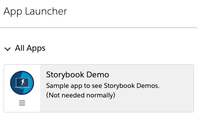
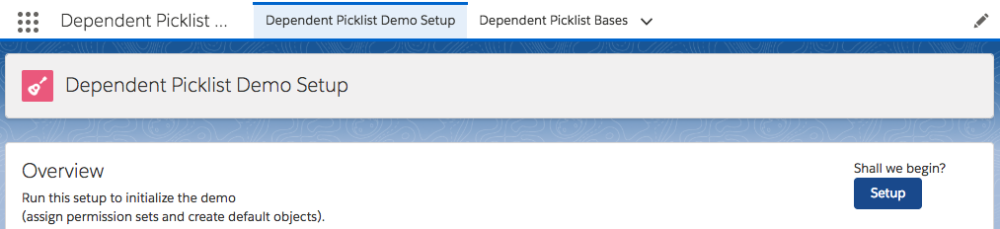
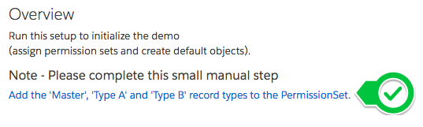

# INTERNAL NOTES

Wait, what is this?

This is meant to be a simple starting point for creating Lightning demo projects

# Structure of the project

* doc - documentation resources
  * images - images for documentation
* data - data used in demo
  * queries - queries used in extracting data for demos
  * trees - data trees used for demos
* dx - salesforce dx project
* mdapi - mdapi version of dx project

# How do I use this?

**If using windows: We're in the middle of migrating to a salesforce cli plugin shortly. Please see the How do I use this manual steps below**

**1.** Download the raw shellscript here:
[https://github.com/SalesforceCloudServices/ltng-support-demo-template/blob/createTemplateProject/createTemplateProject.sh](https://github.com/SalesforceCloudServices/ltng-support-demo-template/blob/createTemplateProject/createTemplateProject.sh)

Place it in a folder that you'll want to store your templates. (The template will be cloned and checked out in the same folder)

**2.** Create a github project within the [SalesforceCloudServices Github](https://github.com/SalesforceCloudServices/)  
with a name similar to: `ltng-support-NAME_OF_DEMO`  
(for example: ltng-support-url-hack)

And copy your new project name.

**(The script will clone the project for you, and populate master for you)**
	
**3.** Run the Shellscript and follow the prompts

	./createTemplateProject.sh
	
	... yadda yadda - remember to make a repo ...
	
	What is the name of the new repository? (ex: ltng-support-url-hack)
	ltng-support-my-project-name
	
	
	The git repository URL is expected to be:
	git@github.com:SalesforceCloudServices/ltng-support-my-project-name.git
	Is this correct? [Y/N]
	y
	
	
	This repository already seems to exist.
	Should we continue? [Y/N]
	y
	
	...
	
	Cloning into 'ltng-support-lds-responsive'...
	
	...
	
	renaming and adding origins
	
	...
	
	pushing project master
	
	...
	
	creating the dx project
	
	...	
	
	-- Your project  has been created
	
	
# How do I use this: Manual Steps

We're in the middle of transitioning from shellscript to a salesforce cli plugin that will accomplish the same as the shellscript.

The manual steps below do the same as the shellscript.

**1.** clone this repository where you will keep your templates:

	git clone git@github.com:SalesforceCloudServices/ltng-support-demo-template.git
	
**2.** import to your demo repo of a similar name: ltng-support-NAME_OF_DEMO

**3.** Create a Salesforce DX project in the 'dx' folder

	//-- newRepositoryName would be the ltng-support-NAME_OF_DEMO
	//-- ex: newRepositoryName="ltng-support-bootstrap"
	sfdx force:project:create --projectname "${newRepositoryName}" -d dx
	
**4.** Rename the org in `config/project-scratch-def.json`
	Change "orgName" value in the JSON to a better name of your scratch org (such as ltng-support-NAME_OF_DEMO)

**5.** Create a scratch org to prepare and store your demo

	// -a [[How you would like to identify the org]]
	// -s [[make the project a default
	// -v [[name of the alias of the lightning support org]]
	// -d [[duration - in days]]
	// -f /path/to/project-scratch-def.json
	
	sfdx force:org:create -d 20 -f config/project-scratch-def.json -s -v [[your hub alias]] -a [[new alias for this scratch org]]
	
	ex:
	
	sfdx force:org:create -d 20 -f config/project-scratch-def.json -v lightningSupport1 -s -a SOME_ALIAS
	
**6.** CLEANUP: Add `**.profiles` within .forceignore, to ensure we do not track profiles (only permission sets)

# Quick Help:

**How do I create a dx project?**  
[sfdx force:project:create](https://developer.salesforce.com/docs/atlas.en-us.sfdx_cli_reference.meta/sfdx_cli_reference/cli_reference_force_project.htm#cli_reference_force_project)

**How do I run a script after installation?**  
[Create an Apex Class that implements InstallHandler](https://developer.salesforce.com/docs/atlas.en-us.packagingGuide.meta/packagingGuide/apex_post_install_script_create.htm)

**How do I convert the dx source to metadata api (mdapi folder)?**

	sfdx force:source:convert -r force-app -d ../mdapi

**How do I create a package?**

Be careful, you need to specify the --containeroptions/-o as Unlocked when you create it (and this cannot be changed)

--containeroptions/-o Unlocked  
--name/-n Name of the package  
--description/-d Description of the package  
--targetdevhubusername/-v Alias of the Dev Hub  

	ex:
	sfdx force:package2:create -o Unlocked -n ltng-support-url-hack -d "Demos of how to replace URL Hack Buttons in Lightning" -v lightningSupport1
	
	sfdx force:package:create -e -t Unlocked -r force-app/ -v lightningSupport1 -n ltng-support-schedule-wizard -d "Your Description"
	
[See Here for more](https://trailhead.salesforce.com/en/modules/unlocked-packages-for-customers/units/build-your-first-unlocked-package)

**Then update the `sfdx-project.json` file**

Add the following to the `packageDirectories` element in that file:

	{
	  "packageDirectories": [ 
	    {
	      "path": "force-app",
	      "default": true,
	      -- add these items below
	      "package": "0Ho_xxx", -- your package2 ID (not subscriber)
	      "versionName": "Version 1.0",
	      "versionNumber": "1.0.0.NEXT"
	      -- add the items above
	    }
	  ],
	  "namespace": "",
	  "sfdcLoginUrl": "https://login.salesforce.com",
	  "sourceApiVersion": "42.0"
	}
	
**THEN you need to create a package version**

sfdx force:package:version:create --path force-app/ --wait 10 --installationkeybypass

**Then** - change the deploy url within the `deploy via url` section down below.

	ex: 
	[https://test.salesforce.com/packaging/installPackage.apexp?p0=YOUR_VERSION_ID](https://test.salesforce.com/packaging/installPackage.apexp?p0=YOUR_VERSION_ID)
	
	and
	(or simply navigate to `https://YOUR_SALESFORCE_INSTANCE/packaging/installPackage.apexp?p0= YOUR_VERSION_ID `  
	if you are already logged in)
	
	turns into
	
	[https://test.salesforce.com/packaging/installPackage.apexp?p0=04t6A000002sreiQAA](https://test.salesforce.com/packaging/installPackage.apexp?p0=04t6A000002sreiQAA)
	
	and
	(or simply navigate to `https://YOUR_SALESFORCE_INSTANCE/packaging/installPackage.apexp?p0= 04t6A000002sreiQAA`  
	if you are already logged in)
	
**How do I export data to trees?**

Create a text file under /data/queries/API_Name__c.txt, with the query to use when exporting out the data.

(Note the query should not include any fields that are read only - such as System fields, etc, but can include [parent-child queries](https://developer.salesforce.com/docs/atlas.en-us.soql_sosl.meta/soql_sosl/sforce_api_calls_soql_relationships_query_using.htm).

	SELECT Name,
	  (
	    SELECT LastName
	    FROM Contacts
	  )
	FROM Account

Then export using the following command:

	sfdx force:data:tree:export -q data/queries/exampleQuicklinks.txt -d data/trees/

**How do I get my password again?**

sfdx force:user:display -u USERNAME

**How do I create a scratch org?**

	// -a [[How you would like to identify the org]]
	// -s [[make the project a default
	// -v [[name of the alias of the lightning support org]]
	// -d [[duration - in days]]
	// -f /path/to/project-scratch-def.json
	
	sfdx force:org:create -v lightningSupport1 -d 20 -f config/project-scratch-def.json -s -a SOME_ALIAS
	
# Before Releasing

* Ensure the logo file/asset name is unique
* Complete the work for the demo in a scratch org
  * Update the demo scripts as needed
  * Ensure the [How to Use](#how-to-use) section is accurate
  * Review the @CHANGE tags within this doc are addressed
  * Review the api names all match (ltng_*) as best as possible)
  * Update any button Related Lists and Object Search Layouts
* Export the data to trees (See [Quick Help](#quick-help) for more)
  * Create all extracts as txt files under /data/queries/   see [Relationship Queries](https://developer.salesforce.com/docs/atlas.en-us.soql_sosl.meta/soql_sosl/sforce_api_calls_soql_relationships.htm)
     * `ex: select Name, (select FirstName, LastName from Contacts) from Account`
  * Extract the data into /data/trees/
     * ex: `sfdx force:data:tree:export -q data/queries/exampleQuicklinks.txt -d data/trees/`
* Create an Unlocked Package for delivery (See [Quick Help](#quick-help) for more)
  * `sfdx force:package2:create -o Unlocked -n ltng-support-url-hack -d "Demos of how to replace URL Hack Buttons in Lightning" -v lightningSupport1`
  * Update in sfdx-project.json
     * "id": "0Ho_xxx", -- your package2 ID (not subscriber)
	  * "versionName": "Version 1.0",
	  * "versionNumber": "1.0.0.NEXT"
* Create Package Version (and new version when code is updated)
  * `sfdx force:package:version:create --path force-app/ --wait 10 --installationkeybypass`
* Create a new scratch org (through the createTemplateProject ...) to test
  * Unlocked Package
  * DX Deployment
  * `sfdx force:org:create -v lightningSupport1 -d 20 -f config/project-scratch-def.json -s -a SOME_ALIAS`
* Convert all DX data into metadata for those that need ant (Last Step)
  * `cd dx; sfdx force:source:convert -r force-app -d ../mdapi`

# DELETE EVERYTHING ABOVE WHEN READY

-----
-----
------
------
------
------
------

# Overview

Please see the [Installation](#install) section below for more on how to install on your Sandbox / Demo org.

**Please note: sample code (metadata api and dx formats) are is also available in the [mdapi](./mdapi) and [dx](./dx) folders above**

---

Overview

---

NOTE: This project is for demonstration purposes.
For more information, please see the [Licensing](#licensing) section below

# Demo

What_the_demo_demonstrates_and_why_we_care

----

NOTE: This project is for demonstration purposes.
For more information, please see the [Licensing](#licensing) section below

# How to Use

How_do_you_use_this_demo

# TLDR How

* Bullet_points_of_how_this_was_done

---

# Install

There are three methods available for you to install this demo, so you can play around with it:

(Please note, all are intended as demonstrations and are not intended for deployment to Production as is)

* [Install via URL](#install-via-url)
* [Install Demo via Salesforce CLI](#install-via-salesforce-cli)
* [Install Demo via Ant/Metadata API](#install-via-metadata-api)

## Install via URL

This works very similar to an App Exchange install.

Please login to an available sandbox and click the link below.

@CHANGE: update the link to the installation id (starts with 04t...)
-- ex: /installPackage.apexp?p0=04t6A000002sreiQAA
-- be sure that there are no spaces (it happens...)

[https://test.salesforce.com/packaging/installPackage.apexp?p0=INSTALL_SF_ID](https://test.salesforce.com/packaging/installPackage.apexp?p0= INSTALL_SF_ID)

(or simply navigate to `https://YOUR_SALESFORCE_INSTANCE/packaging/installPackage.apexp?p0=INSTALL_SF_ID`  
if you are already logged in)

@CHANGE: update image to the install package

It is recommended to install for Admins Only (but all options will work)

##### Run Demo Setup

Next, click on the 'dice' and open the 'URL Hack Demo' app.

@CHANGE: update image to your app in the launcher

and run `Setup` from the `Demo Setup` tab.

@CHANGE: update the image to your setup page

This will then perform any additional setup (such as creating records, etc).

##### Run the Demos

Thats it. See the [How to Use](#how-to-use) section for how to use the app.

@CHANGE: Remove the `Known Issue` section if record types are not needed,
-- otherwise, make the following changes in this section

#### -- Known Issue -- Add the missing permissions on the permission set

If you get an error saying 'This record is not available' (when creating records),
you are likely affectd by a known issue with Unlocked Package deploys.

(This is also mentioned from the Setup page)

We are working with different teams, but it appears as though the installation works correctly from Salesforce CLI, but requires additional steps from the insllation URL.

**We appologize for this inconvenience and are working towards correcting it**

**1.** Navigate to the `Demo Setup` page

@CHANGE: update screenshot to exact image within the Setup
@CHANGE: update the DemoSetup Component to the exact names of the record types needed.
@CHANGE: update to the exact names of the record types to add

and click on the link **Add the 'Master', 'Type A' and 'Type B' record types to the permission set'**

This will navigate you to the permission set in your org.

**3.** Click edit and enable the record types for that permission set.

@CHANGE: update screenshot to exactly the the RecordTypes needed.

## Installing via the Salesforce CLI

This assumes you have already installed the [Salesforce CLI]() and [Connected the Salesforce CLI to your org](https://developer.salesforce.com/docs/atlas.en-us.sfdx_dev.meta/sfdx_dev/sfdx_dev_auth_web_flow.htm).

However, the Salesforce CLI can be used with any org and does not require Salesforce DX to be enabled. (Although enabling the DX / Dev Hub would give some great benefits, and would only require care of [certain object permissions: Scratch Org Info, ActiveScratchOrg, NamespaceRegistry](https://developer.salesforce.com/docs/atlas.en-us.sfdx_setup.meta/sfdx_setup/sfdx_setup_add_users.htm) - as they are not available in all orgs)

**1.** Run the following command:

	sfdx force:mdapi:deploy -d mdapi -u [[orgAlias]] -w

**2.** Add the permission set to your user

@CHANGE: Always use permission sets
- Set the {PermissionSetApiName} to the API name of your Permission Set.

	sfdx force:user:permset:assign -n {PermissionSetApiName} -u [[orgAlias]]
	
**3.** Upload the data

@CHANGE: If data is needed, update the tree file name, often the name of the SObject

	sfdx force:data:tree:import -f data/tree/{SOBJECT}.json -u [[orgAlias]]
	
...

##### Run the Demos

Thats it. See the [How to Use](#how-to-use) section for how to use the app.

	sfdx force:org:open -u [[orgAlias]]

# Bit more detail...

More_detail_on_how_this_was_done

## Component

What_about_the_component

	sample code
	
# Licensing

Copyright 2018 Salesforce

(MIT)

Permission is hereby granted, free of charge, to any person obtaining a copy of this software and associated documentation files (the "Software"), to deal in the Software without restriction, including without limitation the rights to use, copy, modify, merge, publish, distribute, sublicense, and/or sell copies of the Software, and to permit persons to whom the Software is furnished to do so, subject to the following conditions:

The above copyright notice and this permission notice shall be included in all copies or substantial portions of the Software.

THE SOFTWARE IS PROVIDED "AS IS", WITHOUT WARRANTY OF ANY KIND, EXPRESS OR IMPLIED, INCLUDING BUT NOT LIMITED TO THE WARRANTIES OF MERCHANTABILITY, FITNESS FOR A PARTICULAR PURPOSE AND NONINFRINGEMENT. IN NO EVENT SHALL THE AUTHORS OR COPYRIGHT HOLDERS BE LIABLE FOR ANY CLAIM, DAMAGES OR OTHER LIABILITY, WHETHER IN AN ACTION OF CONTRACT, TORT OR OTHERWISE, ARISING FROM, OUT OF OR IN CONNECTION WITH THE SOFTWARE OR THE USE OR OTHER DEALINGS IN THE SOFTWARE.