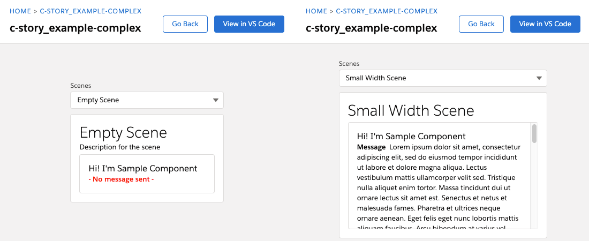
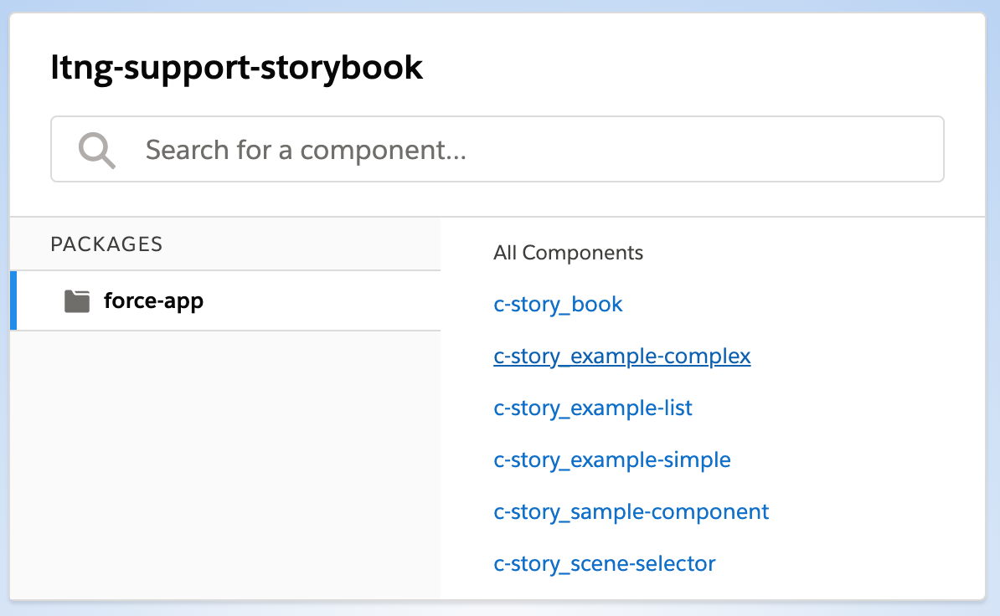
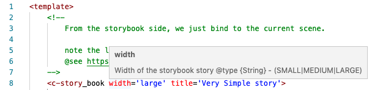
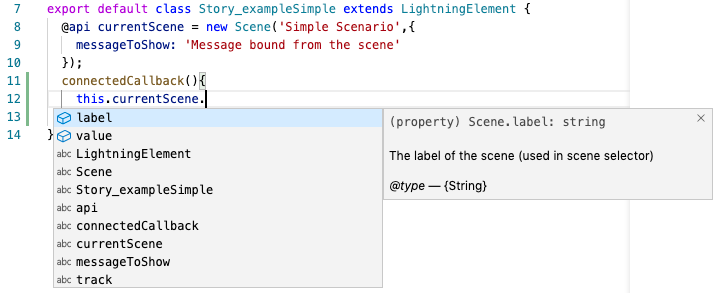
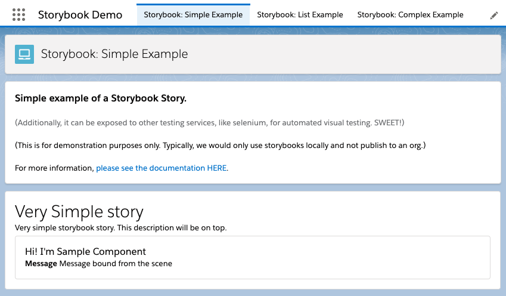
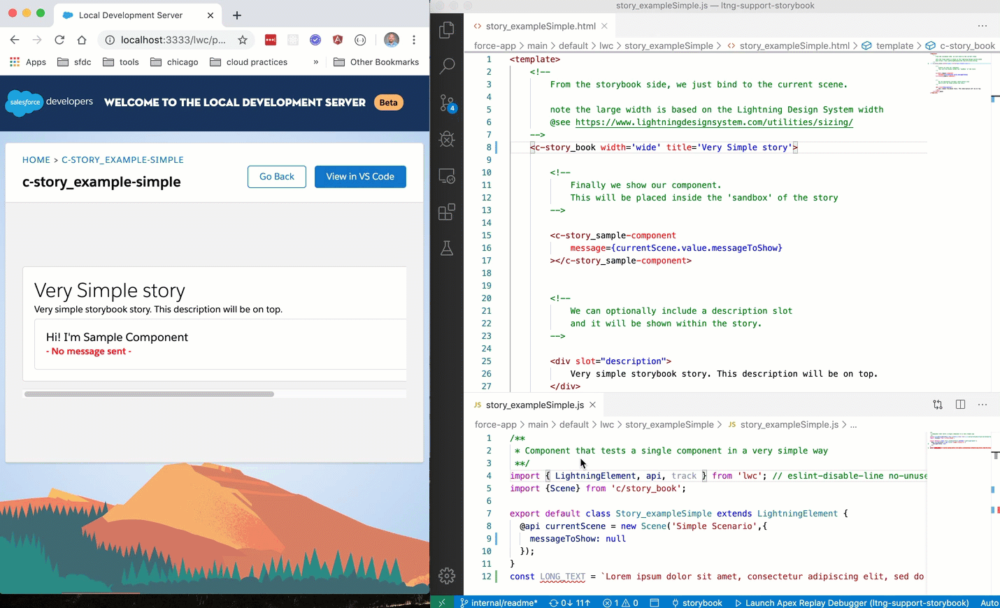
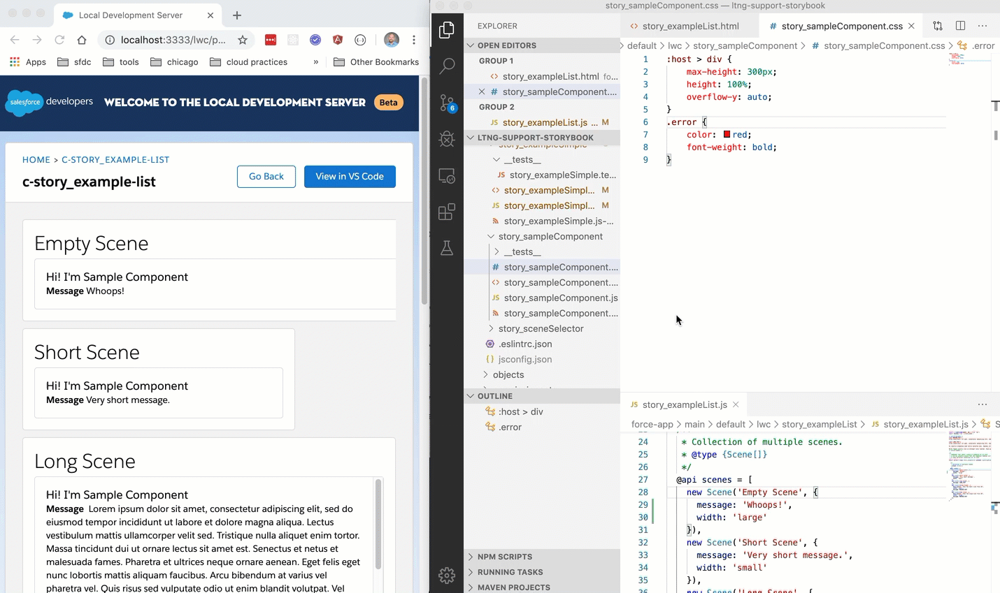
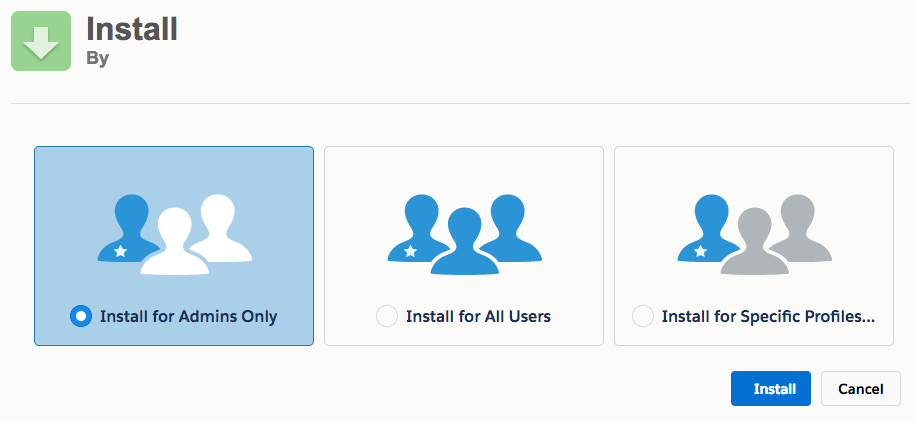

[](https://circleci.com/gh/SalesforceCloudServices/ltng-support-storybook)
[](https://choosealicense.com/licenses/mit/)
[](https://circleci.com/gh/SalesforceCloudServices/ltng-support-storybook)
[](https://circleci.com/gh/SalesforceCloudServices/ltng-support-storybook)


# Overview

Unit Tests are for Logic, are what Storybooks are for Visuals.

This project is for developers and testers to simplify developing and verifying components.

The goal is a simple framework that lets us see the same component in multiple scenarios (stories) next to one another - using hot reloading for instant verification with the [Local Lightning Web Development beta](https://developer.salesforce.com/blogs/2019/10/announcing-lwc-local-development-beta.html)

For example, let's say we wanted to see how the component looked if:

* If the component didn't have an message sent
* If the component had such a large message, it would overflow

**Did the css overflow kick in correctly? Did we get the right css style?  etc.**

So we define each of those as "scenes" with the information that the component binds to.  Each of these define the scenario that we would want to visually verify as we develop.



Now, we are able to keep the testing information outside of the component and in a consistent and reliable way. Without relying on Defaults.

---

Additionally, there may be times where our components require wrapper classes to display properly.


Now we can verify the component looks as we expect within the Local LWC Beta, and without having to deploy.

Stories can provide the necessary context (containing css class wrappers or components) for them to render correctly.

---

Please see the [Installation](#install) section below for more on how to install on your Sandbox / Demo org.

See the samples below for more:

* [Simple](#simple)
* [List](#list)
* [Complex](#complex)

Or see the [How to use section below](#how-to-use) on how to create your own stories.

**Please note: sample code (metadata api and dx formats) are is also available in the [mdapi](./mdapi) and [dx](./dx) folders above**

---

NOTE: This project is for demonstration purposes.
For more information, please see the [Licensing](#licensing) section below

# How to Use

(Please see the [Installation](#install) for setup)

To run the storybooks, simply start your [Local Lightning Web Development beta](https://developer.salesforce.com/blogs/2019/10/announcing-lwc-local-development-beta.html) by running the command `sfdx force:lightning:lwc:start`



## Creating your Stories

All that is needed to create your own stories is:

**Create a `scene_` component**

Create a new Lightning Web Component starting with the prefix `scene_` (ex: scene_comboBox, scene_yourComponent, etc)

**Include a `story_book` component**

Create a [story_book](#story_book) component to contain your test:

ex:

```
<template>
    <c-story_book width='large' title='Very Simple story'>

        <c-story_sample-component
            message={currentScene.value.messageToShow}
        ></c-story_sample-component>

        <div slot="description">
            Very simple storybook story. This description will be on top.
        </div>
    </c-story_book>
</template>
```

See here for more about the [story_book](#story_book) component.

**Include a `Scene` to bind to**

Within your component, create an instance of the [scene](#scene) class to bind your component to.

This simply accepts a label and a value:

```
import {Scene} from 'c/story_book';
const currentScene = new Scene(
	//-- label
	'Simple Scenario',
	//-- value
	{
    	messageToShow: 'Message bound from the scene'
	}
);
```

#### NOTE: .forceignore

It is likely that the stories are desired only to be included within version control and not on the org.

Updating your `.forceignore` file, will ensure the storybook files are available locally, but will not be deployed to the org nor included within your packages.

Add the following lines to your .forceignore file:

* `**/_types`
* `**/scene_*`
* `**/scene_*/**`

## Intellisense

Please note that attention was paid to provide typed access and intelisense for all components.



Within Visual Studio Code, simply hover your cursor over the html attributes and elements for additional documentation.

This also applies for javascript code as-well.



## Example Storybooks

We have created three examples available for you, each as different tabs.



If you would like others to access the demo pages, simply grant them on the `scene_StorybookParticipant` permission set.

ex:

	sfdx force:user:permset:assign -n "scene_StorybookParticipant"

There are three samples provided on how you could write your storybooks:

* [Simple](#simple)
* [List](#list)
* [Complex](#complex)

---

#### NOTE: Likely, you will never need to create Salesforce Pages for you Storybooks.

(Although it is helpful if you desire to automate your visual testing - such as with Selenium)

----

## Simple

A simple example is where you simply have a storybook, and data for it to bind against:



There are three things ultimately needed:

**Custom Component**
Create a custom component that will contain an instance of a `story_book`.

**A story_book Instance**
Within the body of that `story_book` instance, include the component you want to test.

(Optionally, you can include a `title` attribute to name the story. Additionally, a `description` slot is available, to further clarify what is being tested.)

**Scene**
Define a scene within your Custom Component's javascript controller, to bind your component to.

---

In this instance, the story is very close to traditional lightning web component development.  Yet we have a clear way to test how our component will look within this scenario, without deploying to Salesforce.

For more see the [story_exampleSimple](force-app/main/default/lwc/story_exampleSimple/)

## List

Instead of testing once at a time, sometimes we would want to see multiple scenarios all at once.  (This can be helpful for testing css class refactoring)



Similar to the simple example, we are still sticking to mostly traditional lightning web component development.  Yet we iterate over each scenario, and verify how the component behaves with each scenario.

**Custom Component** -
Create a custom component that will contain an instance of `story_book`.

**Multiple Scenes** -
Define an array to contain multiple `Scene` instances on your Custom Component's controller.

**Iterator** -
An iterator that will loop over each Scene within your Scene array.

**A story_book instance** -
Place an instance of story_book and bind it to the `for:item` within your iterator.

Now we will have a story_book instance for each scene.

Note: it is often recommended for your `Scene` records to include information about the test and not just data.  For example, specifying different widths will let you verify different [Lightning Design System widths](https://www.lightningdesignsystem.com/utilities/sizing/) all at once.

For more information, plese see the [story_exampleList](force-app/main/default/lwc/story_exampleList/)

## Complex

Sometimes, you may want to have multiple scenes, but would like to choose between them.  The `Complex` example uses the `story_sceneSelector` component.

Note, that you can specify the initial scene shown by the `story_sceneSelector`, so you can specify which scene to show by default.


Similar to the Simple Example, we simply have a storybook bound to the current Scene.

In this case though, we have a list of multiple scenes and allow the `story_sceneSelector` to help us choose which story to show.

This is simply by listening for a `scene` event (that we listen for here by the `handleSceneChange` handler), and storing it as the scene to bind to.

Here we will need:

**Custom Component** -
Create a custom component that will contain an instance of `story_book` and `story_sceneSelector`

**Multiple Scenes** -
Define an array to contain multiple `Scene` instances on your Custom Component's controller.

**story_sceneSelector** -
We define the initial scene to show by the 'index' (so we can consistently look at the same story after save).  We also must listen for the `save` event (by binding to `onsave` on the component), so we store the event.detail as the "current" scene.

**A story_book instance** -
Place an instance of story_book and bind it to the "current" scene.

Note: it is recommended that an `if:true={...}` checking if the "current" scene is specified - as this will avoid null binding errors until the "current" scene is initialized.

For more information, please see the [Complex Example](force-app/main/default/lwc/story_exampleComplex/)

----

NOTE: This project is for demonstration purposes.
For more information, please see the [Licensing](#licensing) section below

---

# Storybook Components

### Scene

A `Scene` is a class that represents a specific scenario for your component.

<table>
	<tr>
		<th>Attribute</th><th>Type</th><th>Example</th><th>Description</th>
	</tr>
	<tr>
		<td>Label</td><td>String</td><td>Scenario 1</td><td>Required: The label of the scene</td>
	</tr>
	<tr>
		<td>Value</td><td>Object</td><td>{ message: 'Hello' }</td><td>Required: the values that represent the scenario - that you can bind to your component.</td>
	</tr>
</table>

example:

```
import {Scene} from 'c/story_book';
const currentScene = new Scene(
	//-- label
	'Simple Scenario',
	//-- value
	{
    	messageToShow: 'Message bound from the scene'
	}
);
```

The Scene `value` is the most important, as it is the information you will bind to within your component.

We recommend that this also include additional information about the test.  This would allow, for example, to show the component under different widths to see how it fills the space or deals with overflow.

For an example, see the [story_exampleSimple story](force-app/main/default/lwc/story_exampleSimple/)

### story_book

The `story_book` component provides a `sandbox` (a place to demonstrate your component)

<table>
	<tr>
		<th>Attribute</th><th>Type</th><th>Example</th><th>Description</th>
	</tr>
	<tr>
		<td>Title</td><td>String?</td><td>Angry Response</td><td>Optional: title of the story</td>
	</tr>
	<tr>
		<td>width</td><td>String? (wide|large|medium|narrow|small)</td><td>Narrow</td><td>Optional: how wide the sandbox is for your component</td>
	</tr>
	<tr>
		<td>border</td><td>String? (true|false)</td><td>true</td><td>Optional: Whether the sandbox has a border - helpful for measuring margins / etc.</td>
	</tr>
	<tr>
		<td>sandbox-styles</td><td>String?</td><td>"padding: 4px;</td><td>Optional: CSS style to apply to the sandbox for your component - helpful if measuring margins / etc.</td>
	</tr>
</table>

**Description**
Note that providing a &lt;div slot="description"&gt;...&lt;/div&gt;

Puts your slot contents within the story towards the top.

This can be helpful for clarifying what exactly is tested.

**Your Component**

Finally, any contents within the body of the `story_book` should be added for the test.

For an example, see the [story_exampleSimple story](force-app/main/default/lwc/story_exampleSimple/)

# Install

Unlike many other salesforce examples, this does not require deployment to your org.

## Manual Install

Manually installing is placing the Storybook lwc components within your codebase, so you can use it in your project.

**Clone this repository and copy the lwc components **

The only code necessary to use the stories are under the [force-app/main/default/lwc folder](https://github.com/SalesforceCloudServices/ltng-support-storybook/tree/master/force-app/main/default/lwc)

Add these to your force-app/.../lwc folder for your project.

(For now, care is needed when merging the `jsconfig.json` file. This is a known issue.)

**That's it**

See [the How to Use section](#how-to-use) for how to run and create your own stories.

## Install via URL

This works very similar to an App Exchange install.

**Install the package**

Please login to an available sandbox and click the link below.

[https://test.salesforce.com/packaging/installPackage.apexp?p0=04t3s000003OoSDAA0](https://test.salesforce.com/packaging/installPackage.apexp?p0=04t3s000003OoSDAA0)

(or simply navigate to `https://YOUR_SALESFORCE_INSTANCE/packaging/installPackage.apexp?p0=04t3s000003OoSDAA0` <br />
if you are already logged in)



It is recommended to install for Admins Only (but all options will work)

**Pull down the components to run locally**

`sfdx force:source:retrieve -n ltng-support-storybook -p force-app/`

**That's it**

See [the How to Use section](#how-to-use) for how to run and create your own stories.

## Other ways to install

Ultimately, the only things needed to run the storybooks are the [Lightning Web Components under the force-app/main/default/lwc folder](https://github.com/SalesforceCloudServices/ltng-support-storybook/tree/master/force-app/main/default/lwc) locally.

If desired, it is possible to push the code to Salesforce to then download locally - although this is generally not typical.

You can also install using the [Salesforce CLI](https://developer.salesforce.com/tools/sfdxcli)

Then you can either:

* Push the code to your org similar to [Manually Installing](#manual-install)
  * `sfdx force:source:push -u ORG_ALIAS`
* Install the package
  * `sfdx force:package:install --package 04t3s000003OoSDAA0 -u ORG_ALIAS -w 10`
* Install with the Metadata API
  * `sfdx force:mdapi:deploy -w 10 -d mdapi -u ORG_ALIAS`

**Afterwards, pull down the metadata to your local project:**

`sfdx force:source:pull` or `sfdx force:source:retrieve -p force-app/main/default/lwc`

Although, you may need to run the following if you installed the package:

`sfdx force:source:retrieve -n ltng-support-storybook -p force-app/`

**That's it**

See [the How to Use section](#how-to-use) for how to run and create your own stories.
	
# Licensing

Copyright 2020 Salesforce

(MIT)

Permission is hereby granted, free of charge, to any person obtaining a copy of this software and associated documentation files (the "Software"), to deal in the Software without restriction, including without limitation the rights to use, copy, modify, merge, publish, distribute, sublicense, and/or sell copies of the Software, and to permit persons to whom the Software is furnished to do so, subject to the following conditions:

The above copyright notice and this permission notice shall be included in all copies or substantial portions of the Software.

THE SOFTWARE IS PROVIDED "AS IS", WITHOUT WARRANTY OF ANY KIND, EXPRESS OR IMPLIED, INCLUDING BUT NOT LIMITED TO THE WARRANTIES OF MERCHANTABILITY, FITNESS FOR A PARTICULAR PURPOSE AND NONINFRINGEMENT. IN NO EVENT SHALL THE AUTHORS OR COPYRIGHT HOLDERS BE LIABLE FOR ANY CLAIM, DAMAGES OR OTHER LIABILITY, WHETHER IN AN ACTION OF CONTRACT, TORT OR OTHERWISE, ARISING FROM, OUT OF OR IN CONNECTION WITH THE SOFTWARE OR THE USE OR OTHER DEALINGS IN THE SOFTWARE.
